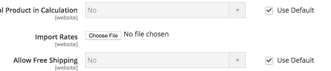

# Magento2 Indonesia Shipping Rate
this is custom shipping rate for indonesia.

Instalation:

    composer config repositories.icubeus-advancerate git git@github.com:icubeus/magento2-advancerate.git
    
    composer require "icubeus/magento2-advancerate":"dev-master"

To update:

    composer update icubeus/magento2-advancerate

after instalation each product will have 3 custom attribute now (Dimension Package Height,Dimension Package width, Dimension Package length) for dimensional calculation purpose

configuration:

* go to admin System > Configuration > Shipping Method
* Open up shipping method "Advance Rate"
* Restrict Rule For Calculation : Weight and Destination
* Weight In : if the product weight in Gram, please choose Gram. if the product weight in Kilogram, please choose Kilogram.
* Dimensional Calculation : this is setting to compare between dimensional and actual weight.
* Show Estimation Time : estimate delivery
* etc

sample Indonesia shipping rate (make sure the store view is "default view")
[sample.csv](https://github.com/icubeus/magento2-advancerate/blob/master/contributing/sample.csv)

Note: please don't forget to enable one of the default shipping magento, and set to another country. example: free shipping, country to afganistan. this action is a MUST, because if we didn't do it, the rate won't appear in guest checkout.

